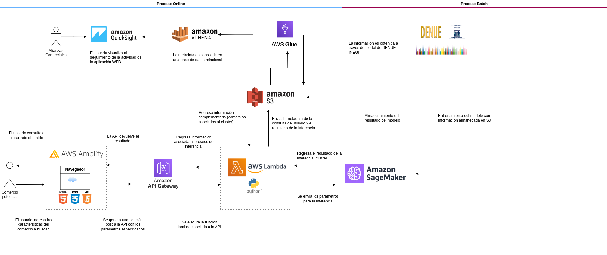

# Buscador de comercios

Este repositorio contiene el código para implementar el producto de datos llamado "Buscador de comercios", el cuál permita obtener la ubicación geografica de comercios similares dadas ciertas características. Para mayor información acerca del objetivo del producto de datos consultar la carpeta ```docs/ ```

La estructura del respositorio corresponde a la siguiente arquitectura:



por lo que cada carpeta contiene el código requerido para cumplir los siguientes objetivos:

```bash
  ├── src/
  │   ├── etl/          (#Obtener información del INEGI y almancenarla en S3)
  │   ├── app/          (#Generar el front end para el usuario)
  │   ├── api/          (#Programa la API para consumo del modelo y orquestador de la API)
  │   ├── model/        (#Entrenamiento del modelo) 
  │   ├── reporting/    (#Generar la base de datos para el tablero de seguimiento diario) 


```


## Documentación


La documentación del proyecto se encuentra en la carpeta``` docs/ ``` y contiene los siguientes elementos:

- Working backwards
    + FAQ's
    + Press Release
    + Boceto de la solución.
    + Cinco preguntas alrededor del cliente 
- Diseño de la arquitectura de datos
- Presentación ejecutiva


## API Reference
Durante el desarrollo del producto de datos se generó la siguiente API

#### Get all items

```http
  POST /consultaNegocio/
```

| Parameter | Type     | Description                |
| :-------- | :------- | :------------------------- |
| `json` | `json` | **Required**. Las características del negocio|


## Tech Stack

**Client:** Javascript, CSS

**Server:** Python


## Demo

La demo del proyecto se puede consultar a través de los siguientes links:

- [Web app Buscador de negocios](https://dev.d3v00y4hvhsfhc.amplifyapp.com)
- [Tablero de seguimiento diario](https://us-east-1.quicksight.aws.amazon.com/sn/dashboards/f4de0446-e452-4995-b051-e256fe3df6c6)


## Integrantes

+ Edgar Adrián López González-141236
+ Aline Lizeth Pérez López

